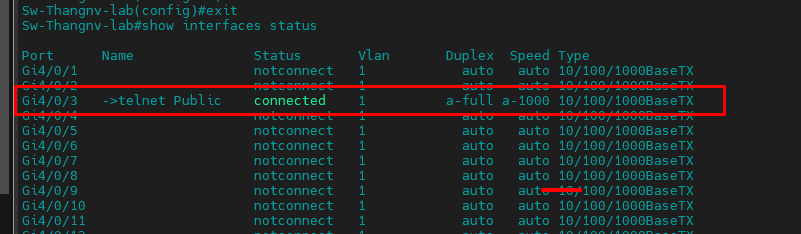
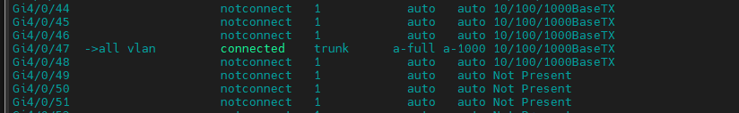
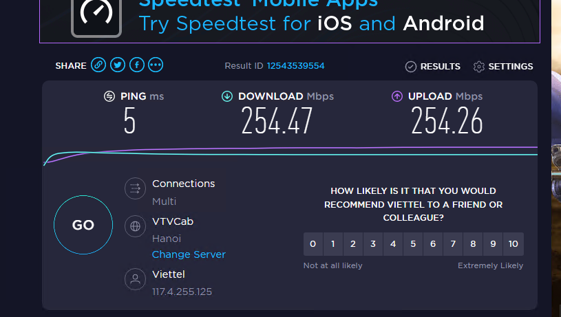
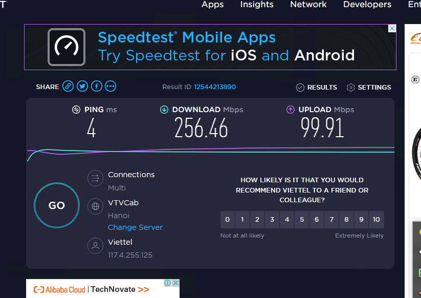

<h1 align="center">Ghi chép các thao tác cấu hình cơ bản ban đầu Switch Cisco 3750</h1>


# I. Reset Switch default
- Để thực hiện Reset Switch default ta cắm dây console vào Switch và thực hiện trên mode `enable`

```sh
Thangnv-Lab-3750>enable
Password:
Thangnv-Lab-3750#
```
- thực hiện thao tác lệnh xóa các file config
```sh
del flash:config.text
del flash:vlan.dat
wr erase
reload
```
- Thực hiện xác nhận khi có yêu cầu **`confirm`**. Reload SW xong là SW về default

# II. Thiết lập cấu hình cơ bản
## 1. Mode config
- Các mode cấu hình cơ bản trên Switch
```sh
User mode (chế độ user) : Switch>
Enter Privilege mode (vào chế độ đặc quyền): Switch>enable
Privileged mode (chế độ đặc quyền): Switch#
Enter configuration mode (vào chế độ cấu hình): Switch#configure terminal
Global Config mode: Switch(config)#
Vào Interface mode: Switch(config)#interface fa0/1
Interface mode: Switch(config-if)
Return to global configuration (Trở về Global Config): Switch(config-if)exit
Exit Global Config mode (Thoát Global Config): Switch(config)#exit
Return to user mode (Trở về user mode): Switch#disable
Logout (Đăng xuất): Switch>exit
```

- Thiết lập thời gian
```sh
Thangnv-Lab-3750#show clock
*19:26:00.997 UTC Mon Mar 1 1993
Thangnv-Lab-3750#clock set 10:46:00 11 December 2021
Thangnv-Lab-3750#show clock
10:46:01.526 UTC Sat Dec 11 2021
Thangnv-Lab-3750#
```

- Cấu hình hostname
```sh
Switch#configure terminal
Enter configuration commands, one per line.  End with CNTL/Z.
Switch(config)#hostname Sw-Thangnv-lab
Sw-Thangnv-lab(config)#
```
## 2. Cấu hình thiết lập password

### 2.1 Thiết lập password `enable`
```sh
Sw-Thangnv-lab#configure terminal
Enter configuration commands, one per line.  End with CNTL/Z.
Sw-Thangnv-lab(config)#enable password Abc@123abc   // password là: Abc@123abc
```
- thiết lập mật khẩu ở dạng mã hóa config
```sh
Sw-Thangnv-lab(config)#enable secret Abc@123abc
```

### 2.2 thiết lập mật khẩu console

```sh
Sw-Thangnv-lab#configure terminal
Enter configuration commands, one per line.  End with CNTL/Z.
Sw-Thangnv-lab(config)#line console 0
Sw-Thangnv-lab(config-line)#password Abc@123abc
Sw-Thangnv-lab(config-line)#exit
Sw-Thangnv-lab(config)#
```
### 2.3 Thiết lập mật khẩu telnet
```sh
Sw-Thangnv-lab#configure terminal
Enter configuration commands, one per line.  End with CNTL/Z.
Sw-Thangnv-lab(config)#line vty 0 4
Sw-Thangnv-lab(config-line)#login
Sw-Thangnv-lab(config-line)#password Abc@123abc
Sw-Thangnv-lab(config-line)#exit
Sw-Thangnv-lab(config)#
```

### 2.4 Thiết lập lưu cấu hình config khi khởi động lại
```sh
Sw-Thangnv-lab#copy running-config startup-config
```
- reboot Switch
```sh
Reload switch
```

## 3. Cấu hình vlan

### 3.1 khởi tạo vlan

```sh
Sw-Thangnv-lab#configure terminal
Enter configuration commands, one per line.  End with CNTL/Z.
Sw-Thangnv-lab(config)#vlan 33
Sw-Thangnv-lab(config-vlan)#name vlan33
Sw-Thangnv-lab(config-vlan)#exit
```
### 3.2 Cấu hình IP vlan
- Đối với Switch không không có chế độ cấu hình IP cho `Port Interface` mà chỉ có thể thực hiện cấu hình cho `interface vlan`

```sh
Sw-Thangnv-lab#configure terminal
Enter configuration commands, one per line.  End with CNTL/Z.
Sw-Thangnv-lab(config)#interface vlan 1
Sw-Thangnv-lab(config-if)#description -->Manage vlan1
Sw-Thangnv-lab(config-if)#ip address 172.16.7.100 255.255.240.0
Sw-Thangnv-lab(config-if)#ip default-gateway 172.16.10.1
Sw-Thangnv-lab(config)#exit
```
- `ip default-gateway` sử dụng với mục địch kết nối Sw ra internet. trong trường sử dụng local không cần internet không cần đặt `ip default-gateway`

## 4. Cấu hình Interface
- Để thực hiện cấu hình IP telnet cần thực hiện cắm dây mạng vào `Port` cần thiết lập telnet, sau đó khởi tạo 1 vlan sử dụng cho dịch vụ `MNGT`, access vlan `MNGT` vào port sử dụng telnet và thực hiện cấu hình IP telnet. Ngoài ra, `vlan 1` là vlan mặc định trên các Switch đã được gắn sắn vào tất cả các port trên Switch nên cũng có thể sử  dụng để cấu hình telnet mà không cần khởi tạo `VLAN`

- ở đây sử dụng vlan 1 để làm vlan `MNGT` -> add vlan 1 cho interface: `Gi4/0/3`

```sh
Sw-Thangnv-lab#configure terminal
Enter configuration commands, one per line.  End with CNTL/Z.
Sw-Thangnv-lab(config)#interface Gi4/0/3

Sw-Thangnv-lab(config-if)#description ->telnet Public
Sw-Thangnv-lab(config-if)#no shutdown
Sw-Thangnv-lab(config-if)#switchport mode access
Sw-Thangnv-lab(config-if)#switchport access vlan 1
Sw-Thangnv-lab(config)#exit
```
<h3 align="center"></h3>

- Các mode cấu hình `interface`:

  - `mode access`: đây là chế độ cấu hình cho phép 1 vlan nhất định được phép đi qua `interface`

  - `mode trunk`: Cấu hình cho phép nhiều vlan đi qua 1 vlan trong cùng 1 thời điểm


> Đối với dòng 3500 trở lên phải vào bật dot1Q hay ISL nó mới chạy. Nếu không bật sẽ báo lỗi:
>```sh
>Sw-Thangnv-lab(config)#interface Gi4/0/47
>Sw-Thangnv-lab(config-if)#switchport trunk encapsulation [dot1Q hay ISL]
>Sw-Thangnv-lab(config-if)#no shutdown
>Sw-Thangnv-lab(config-if)#switchport mode trunk
>Sw-Thangnv-lab(config-if)#exit
>```

<h3 align="center"></h3>

## 3. Cấu hình bandwidth
- Giới hạn Bandwidth trên Switch giúp để người quản trị mạng LAN có thể kiểm soát được băng thông kết nối từ bên trong ra bên ngoài internet trong hệ thống mạng LAN.
### 3.1 Kích hoạt tính năng QoS

```sh
Sw-Thangnv-lab#configure terminal
Enter configuration commands, one per line.  End with CNTL/Z.
Sw-Thangnv-lab(config)#mls qos
Sw-Thangnv-lab(config)#
```
### 3.2 ip access-list extended 

```sh
Sw-Thangnv-lab#configure terminal
Enter configuration commands, one per line.  End with CNTL/Z.
Sw-Thangnv-lab(config)#ip access-list extended limit_100MBps
Sw-Thangnv-lab(config-ext-nacl)#permit ip any any
Sw-Thangnv-lab(config-ext-nacl)#exit
Sw-Thangnv-lab(config)#
```

### 3.3 Tạo class map để phân loại các traffic

```sh
Sw-Thangnv-lab#configure terminal
Enter configuration commands, one per line.  End with CNTL/Z.
Sw-Thangnv-lab(config)#class-map match-all limit_100MBps
Sw-Thangnv-lab(config-cmap)#match access-group name limit_100MBps
Sw-Thangnv-lab(config-cmap)#exit
Sw-Thangnv-lab(config)#
```

### 3.4 Tạo Policy

```sh
Sw-Thangnv-lab#configure terminal
Enter configuration commands, one per line.  End with CNTL/Z.
Sw-Thangnv-lab(config)#policy-map limit_input_100MBps
Sw-Thangnv-lab(config-pmap)#class limit_100MBps
Sw-Thangnv-lab(config-pmap-c)#police 104857600 1000000 exceed-action drop
Sw-Thangnv-lab(config-pmap-c)#exit
Sw-Thangnv-lab(config-pmap)#exit
Sw-Thangnv-lab(config)#
```

### 3.5 Gán Policy cho cổng mạng muốn hạn chế tốc độ

```sh
Sw-Thangnv-lab#configure terminal
Enter configuration commands, one per line.  End with CNTL/Z.
Sw-Thangnv-lab(config)#interface Gi4/0/7
Sw-Thangnv-lab(config-if)#service-policy input limit_input_100MBps
Sw-Thangnv-lab(config-if)#exit
Sw-Thangnv-lab(config)#exit
Sw-Thangnv-lab#copy running-config startup-config

```
#### Kiểm tra
- trước:
<h3 align="center"></h3>

- Sau: 
<h3 align="center"></h3>

# Tài liệu tham khảo
- https://www.cisco.com/c/en/us/td/docs/switches/lan/catalyst3750/software/release/12-2_35_se/configuration/guide/scg.html